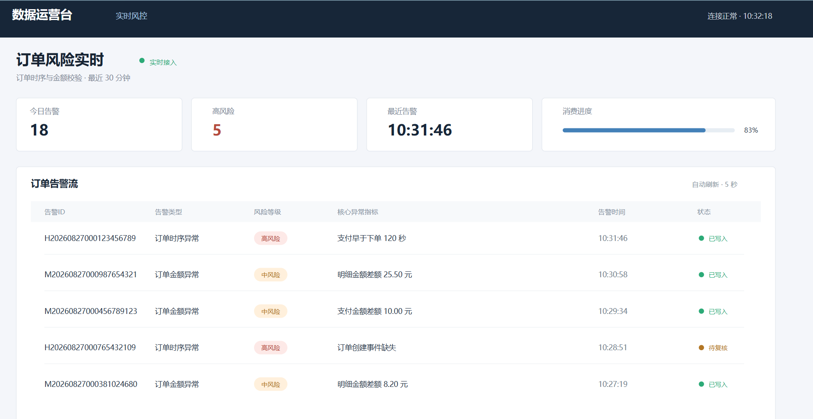
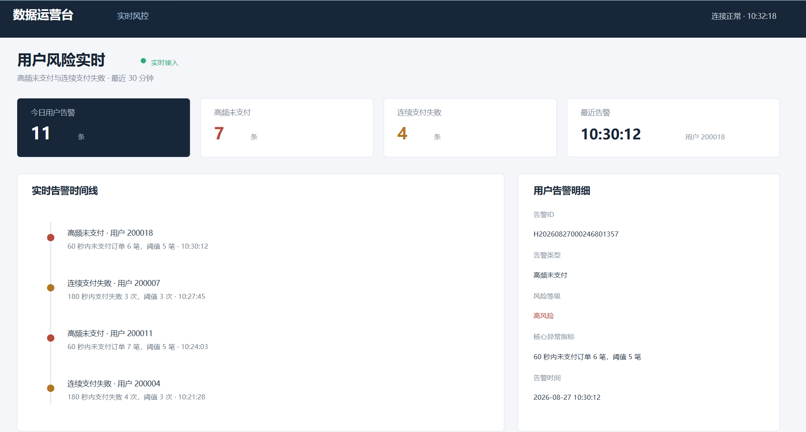
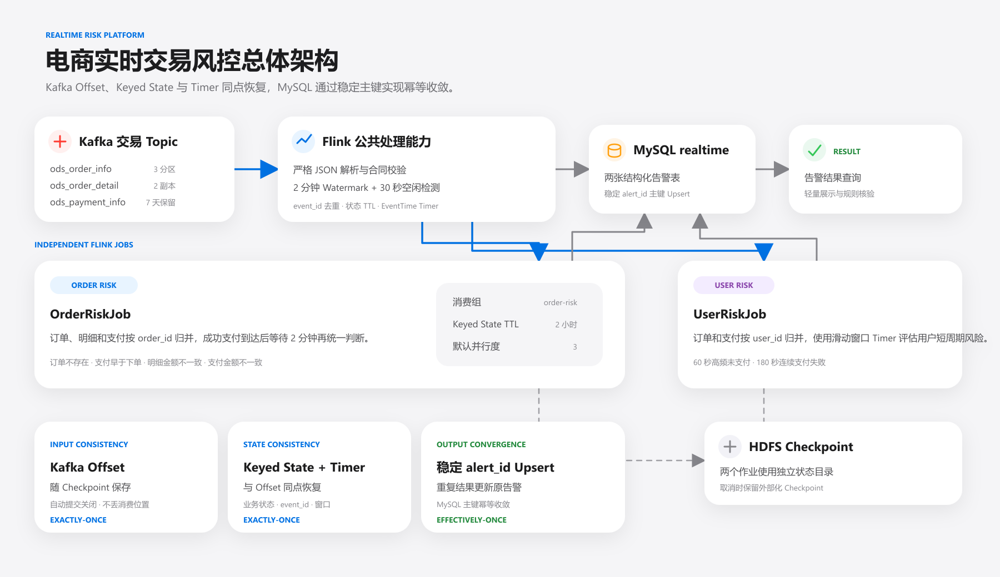
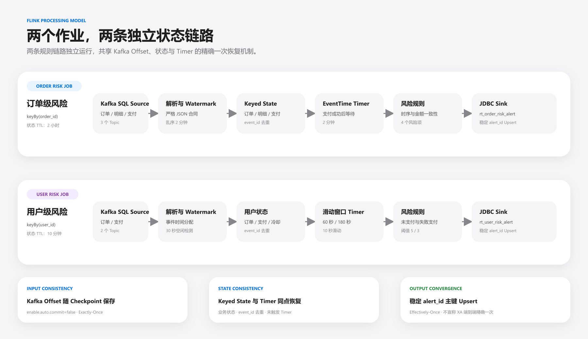

# 电商实时交易风控

基于 **Kafka、Flink 1.19.1、Java 17 和 MySQL** 构建的电商实时交易风控项目。系统同时消费订单、订单明细和支付事件，使用事件时间、Watermark、Keyed State 与 EventTime Timer 处理跨 Topic 乱序，识别订单时序、金额一致性和用户短周期行为风险，并将结构化告警写入 MySQL `realtime`。项目核心工程能力是以 Checkpoint 将 Kafka 消费位置、算子状态和 Timer 固化在同一个一致点，实现 Flink 状态范围内的精确一次恢复。

关联离线数仓仓库：[offline_warehouse](https://github.com/jwdghmld/offline_warehouse)

## 项目目标

- 用统一 Kafka 合同承接订单、明细和支付三类交易事件。
- 正确处理同一订单跨 Topic 到达顺序不确定的问题。
- 通过 `event_id`、状态 TTL 和稳定告警主键控制重复数据。
- 将订单级风险和用户级风险拆成两个独立 Flink 作业。
- 使用 EventTime Timer 等待迟到数据，并按业务时间完成判断。
- 启用 Exactly-Once Checkpoint，将 Kafka Offset、Keyed State 和 Timer 恢复到同一个一致点。
- 输出可查询、可筛选、可追溯的 MySQL 风险告警表。
- 明确 Kafka、Flink 状态和 JDBC Sink 之间的一致性边界。

## 最终结果

### 订单风险监控

订单结果页展示风险类型、风险项、等级、订单与支付标识、异常金额或异常时差，以及规则判定时间。可用于核对“支付存在但订单缺失”“支付早于下单”和交易金额不一致等场景。



### 用户风险监控

用户结果页展示短时间高频未支付和连续支付失败告警，并保留统计周期、实际次数、规则阈值和告警时间，便于回溯触发依据。



## 总体架构



实时链路从离线仓库的数据生成阶段接收有限批次交易事件，但两个仓库保持独立部署：

1. Kafka 按 `order_id` 对单个 Topic 分区，但不保证同一订单跨 Topic 的到达顺序。
2. Flink SQL Source 定义输入字段和严格 JSON 解析规则，DataStream API 完成 Watermark、状态和 Timer 处理。
3. `OrderRiskJob` 按 `order_id` 归并交易，`UserRiskJob` 按 `user_id` 聚合短周期行为。
4. 两个作业使用独立消费组、状态和 Checkpoint 子目录。
5. 告警通过 JDBC Upsert 写入 MySQL，Python 查询结果表供轻量页面展示。

## 精确一次语义设计

> 本项目通过 Checkpoint 将 Kafka Offset、Flink 算子状态和 EventTime Timer 固化在同一个一致点，实现 Exactly-Once State Recovery；MySQL 输出通过稳定业务主键和 Upsert 实现幂等收敛，形成完整的实时风险结果一致性方案。

### 语义边界

| 链路范围 | 项目提供的语义 | 实现依据 |
|---|---|---|
| Kafka → Flink Source | Exactly-Once 状态恢复 | Kafka Offset 进入 Checkpoint，`enable.auto.commit=false` |
| Flink Keyed State | Exactly-Once 状态恢复 | 订单、支付、窗口、冷却和去重状态随 Checkpoint 固化 |
| EventTime Timer | Exactly-Once 状态恢复 | 未触发 Timer 与算子状态恢复到同一个一致点 |
| Flink → MySQL | 幂等 Effectively-Once | 稳定 `alert_id` 命中 MySQL 主键并执行 Upsert |

### 一致性恢复原理

```text
Kafka 消费位置
      │
      ├── Kafka Offset
      ├── Keyed State
      ├── event_id 去重状态
      └── EventTime Timer
              │
        同一个 Checkpoint
              │
        HDFS 持久化存储
              │
      故障后从一致点整体恢复
```

Checkpoint 成功前发生故障时，Flink 会同时回退消费位置、业务状态、去重集合和 Timer，而不是只回退 Kafka Offset。重新消费的数据会在相同状态上下文中再次计算，因此不会出现“Offset 已前进但状态未保存”造成的数据缺口。

### 故障场景

| 故障位置 | 恢复行为 | 最终效果 |
|---|---|---|
| 消息读取后、状态更新前失败 | 从最近 Checkpoint Offset 重新消费 | 消息不会丢失 |
| 状态更新后、Checkpoint 成功前失败 | Offset、状态和 Timer 一起回退 | 重新计算，不保留半完成状态 |
| Checkpoint 成功后 TaskManager 失败 | 从新 Checkpoint 恢复完整一致点 | 已确认状态不需要从更早位置重建 |
| MySQL 写入后、Checkpoint 成功前失败 | 告警可能重新计算并再次写入 | 相同 `alert_id` Upsert 原记录，不新增重复行 |
| 作业取消或计划恢复 | 保留外部化 Checkpoint，按独立状态目录恢复 | 两个作业互不覆盖状态 |

### 双层去重

- 输入层：稳定 `event_id` 保存在 Keyed State 中，抵抗 Producer 重发和 Checkpoint 恢复后的重复消费。
- 输出层：稳定 `alert_id` 只依赖业务日期、业务键和规则编码，不依赖处理时间、TaskManager 或并行子任务。
- MySQL 层：`alert_id` 是结果表主键，重复写入更新原告警，使故障窗口中的重复输出最终收敛。

## 技术栈

| 分类 | 技术与版本 | 用途 |
|---|---|---|
| 开发语言 | Java 17 | 实现两个 Flink 风控作业与测试 |
| 实时计算 | Apache Flink 1.19.1 | 事件时间、状态、Timer、Checkpoint 和 Table/DataStream 混合处理 |
| 消息系统 | Kafka Connector 3.3.0-1.19 | 消费三个交易 Topic |
| 输入格式 | Flink JSON Format | 严格解析并校验消息字段 |
| 结果存储 | MySQL 8.x、Flink JDBC Connector 3.2.0-1.19 | Upsert 两张结构化告警表 |
| 状态存储 | HDFS 3.3.4 | 保存 Checkpoint 与外部化恢复状态 |
| 构建测试 | Maven、JUnit 5.10.3 | 依赖管理、打包和规则单元测试 |
| 时间标准 | Asia/Shanghai | 统一事件时间、告警日期和 MySQL 时间语义 |

## Kafka 输入合同

合同版本为 `1.0.0`。三个 Topic 均为 3 分区、默认 2 副本、保留 7 天，消息 Key 为十进制字符串形式的 `order_id`，Value 为 UTF-8 JSON。

| Topic | 事件类型 | 业务粒度 | 被哪个作业消费 |
|---|---|---|---|
| `ods_order_info` | `ORDER_CREATED` | 一次订单创建 | 订单风险、用户风险 |
| `ods_order_detail` | `ORDER_DETAIL` | 一条订单商品明细 | 订单风险 |
| `ods_payment_info` | `PAYMENT_SUCCESS`、`PAYMENT_FAILED` | 一次支付尝试 | 订单风险、用户风险 |

所有消息包含稳定 `event_id`、`event_type`、`event_time` 和 `business_date`。金额直接映射为 `DECIMAL(20,2)`，避免经过 Double 产生精度损失。完整字段、示例和发布约束见 [`contracts/kafka/topic-contract.md`](contracts/kafka/topic-contract.md)。

## Flink 作业内部链路



### 公共输入阶段

两个作业采用相同的公共处理策略：

- 通过 Flink SQL `CREATE TEMPORARY TABLE` 明确定义 Kafka Source 字段。
- `json.fail-on-missing-field=true`，缺少必需字段时直接失败。
- `json.ignore-parse-errors=false`，不静默跳过不符合合同的数据。
- 解析器校验事件类型、日期、时间、金额和业务标识后生成统一 `RiskEvent`。
- 使用 2 分钟有界乱序 Watermark，并对 30 秒无数据的分区启用空闲检测。
- 使用 `event_id` 状态去重，抵抗 Producer 重发和恢复后的重复消费。

### OrderRiskJob：订单级风险

```text
订单 + 明细 + 支付
  -> union
  -> keyBy(order_id)
  -> 保存订单、明细、支付和已处理事件状态
  -> 成功支付时间 + 2 分钟注册 EventTime Timer
  -> Timer 到达后统一检查时序与金额
  -> rt_order_risk_alert
```

成功支付事件到达后不会立即判断。作业额外等待 2 分钟，为跨 Topic 迟到的订单和明细事件留出时间；Timer 触发后聚合订单明细金额并执行四条规则。

| 风险项 | 风险等级 | 判断依据 |
|---|---|---|
| 订单不存在 | 高风险 | 成功支付已到达，等待结束后仍未收到订单创建事件 |
| 支付早于下单 | 高风险 | `payment_time < order_create_time` |
| 明细金额不一致 | 中风险 | 明细 `final_amount` 合计不等于订单金额 |
| 支付金额不一致 | 中风险 | 成功支付金额不等于订单金额 |

订单、明细、支付及去重状态 TTL 为 2 小时。判断完成后主动清理订单级业务状态，避免已完成订单长期占用状态空间。

### UserRiskJob：用户级风险

```text
订单 + 支付
  -> union
  -> keyBy(user_id)
  -> 保存订单时间、已支付订单、失败支付和窗口标记
  -> 10 秒滑动的 EventTime Timer
  -> 60 秒未支付 / 180 秒失败支付规则
  -> rt_user_risk_alert
```

| 风险项 | 窗口与阈值 | 判定方式 |
|---|---|---|
| 高频未支付 | 60 秒内未支付订单数大于 5 | 窗口结束后再等待 2 分钟，排除跨 Topic 迟到的成功支付 |
| 连续支付失败 | 180 秒内失败支付次数大于等于 3 | 在对应滑动窗口结束点执行判断 |

两个规则均使用 10 秒滑动步长和 180 秒冷却时间，避免同一段高风险行为在相邻窗口连续刷出重复告警。用户状态 TTL 为 10 分钟。

## 事件时间与乱序处理

本项目只使用消息中的 `event_time` 推进业务时间，不以机器处理时间替代事件时间。

| 机制 | 配置 | 作用 |
|---|---:|---|
| 有界乱序 Watermark | 2 分钟 | 容忍 Kafka 分区和跨 Topic 的正常乱序 |
| 空闲分区检测 | 30 秒 | 防止无数据分区长期阻塞全局 Watermark |
| 订单判断等待 | 成功支付后 2 分钟 | 等待订单与明细补齐后再检查 |
| 未支付额外等待 | 窗口结束后 2 分钟 | 等待可能迟到的成功支付事件 |
| 状态 TTL | 订单 2 小时、用户 10 分钟 | 控制状态长期增长 |
| 迟到指标 | `late_events` | 记录已落后于当前 Watermark 的事件 |

超过 2 分钟乱序范围的事件会记录日志和指标，但不会回撤已输出告警。该边界与 Kafka 合同中的受控乱序约束保持一致。

## 状态、Timer 与去重

| 作业 | Key | 主要状态 | Timer 用途 |
|---|---|---|---|
| `OrderRiskJob` | `order_id` | 订单快照、明细 Map、支付 Map、已处理事件 Map | 成功支付后等待 2 分钟统一判断 |
| `UserRiskJob` | `user_id` | 订单时间、已支付订单、失败支付、窗口集合、冷却标记、已处理事件 | 计算 60 秒和 180 秒滑动窗口 |

`event_id` 解决输入消息重复，稳定 `alert_id` 解决输出重复。告警 ID 由风险等级前缀、业务日期和业务键哈希生成；相同业务事实在 Kafka 重发、Checkpoint 恢复或人工重跑时会得到相同主键。

## Checkpoint 参数与恢复配置

```text
Checkpoint 周期：60 秒
Checkpoint 模式：Exactly-Once
Checkpoint 超时：10 分钟
最小间隔：30 秒
最大并发：1
取消策略：保留外部化 Checkpoint
失败重启：最多 3 次，每次间隔 30 秒
默认并行度：3
```

两个作业分别使用 `order-risk` 和 `user-risk` 消费组，并写入独立 Checkpoint 子目录。Checkpoint 成功后形成新的恢复一致点；失败的 Checkpoint 不会推进恢复基线。具体故障窗口与输出边界见前文“精确一次语义设计”。

## MySQL 结果表

| 表名 | 结果粒度 | 主要用途 |
|---|---|---|
| `realtime.rt_order_risk_alert` | 一行一条订单风险项 | 查询异常订单、风险类型、金额差额和时间差 |
| `realtime.rt_user_risk_alert` | 一行一个用户在窗口结束点产生的风险 | 查询短周期行为次数、阈值和风险时间 |

两张表均以 `alert_id` 为主键，并按日期、类型、等级和业务实体建立查询索引。DDL 还包含风险类型、等级、计数、日期和更新时间等约束，用于阻止不符合规则的结果进入服务表。

JDBC Sink 每 100 行或 1 秒触发一次缓冲刷新，失败最多重试 3 次。稳定主键确保同一告警再次写入时更新原记录，而不是新增重复行。

## 资源与作业隔离

```text
默认并行度 = 3
建议 TaskManager = 2
建议每个 TaskManager Slot = 3
order-risk 消费组 -> order-risk Checkpoint 子目录
user-risk 消费组  -> user-risk Checkpoint 子目录
```

两个作业可以独立提交、停止和恢复。一侧规则故障不会共享另一侧的 Keyed State 或消费进度；公共部分仅限 Kafka 合同、事件模型、解析器、时间工具和基础配置读取方式。

## 配置方式

仓库只保留 [`config/realtime-env.sh`](config/realtime-env.sh) 环境变量模板,作业通过 `RealtimeConfig` 统一读取：

```text
KAFKA_BOOTSTRAP_SERVERS
MYSQL_HOST / MYSQL_PORT / MYSQL_USER / MYSQL_PASSWORD
REALTIME_MYSQL_DATABASE
MYSQL_CHARSET / MYSQL_TIMEZONE
FLINK_CHECKPOINT_ROOT
```

`FLINK_CHECKPOINT_ROOT` 必须指向 Flink 集群所有节点都能访问的持久化文件系统。两个作业会在该根目录下自动使用独立子目录。

## 仓库目录

```text
realtime_risk/
├── .github/
│   └── workflows/ci.yml                 # Maven 测试、Shell 和样例 JSON 校验
├── config/
│   └── realtime-env.sh                  # 统一环境变量模板
├── contracts/
│   ├── kafka/topic-contract.md          # 与离线仓库共享的 Kafka 合同
│   └── mysql/03_realtime.sql             # 两张实时告警表 DDL
├── docs/
│   ├── design.md                        # 状态、Timer、主键和代码级设计
│   ├── deployment.md                    # 集群配置、提交与恢复说明
│   └── images/                          # PNG 架构图与结果截图
├── flink/
│   ├── pom.xml                          # Java 17 / Flink 1.19.1 Maven 工程
│   └── src/
│       ├── main/java/com/ecommerce/realtime/
│       │   ├── config/RealtimeConfig.java
│       │   ├── job/OrderRiskJob.java
│       │   ├── job/UserRiskJob.java
│       │   ├── model/RiskEvent.java
│       │   ├── sql/EventParsers.java
│       │   └── util/TimeUtils.java
│       └── test/java/com/ecommerce/realtime/  # 规则与时间工具测试
├── kafka/
│   └── create-topics.sh                 # 幂等创建三个交易 Topic
├── samples/events/                      # 订单、明细和支付 JSONL 联调样例
├── .gitignore
└── README.md
```

## 双仓关系与项目边界

- 当前仓库负责实时风险检测和告警结果。
- 业务数据生成、离线数仓和 ADS 发布位于 [offline_warehouse](https://github.com/jwdghmld/offline_warehouse)。
- 两个仓库共享 `contracts/kafka/topic-contract.md`，当前合同版本为 `1.0.0`。
- 配置中的“此处自定义”必须由部署者按实际环境填写。

## 延伸文档

- [实时风控代码级设计](docs/design.md)
- [实时部署与故障恢复](docs/deployment.md)
- [Kafka 交易事件合同](contracts/kafka/topic-contract.md)
- [离线数仓仓库](https://github.com/jwdghmld/offline_warehouse)
